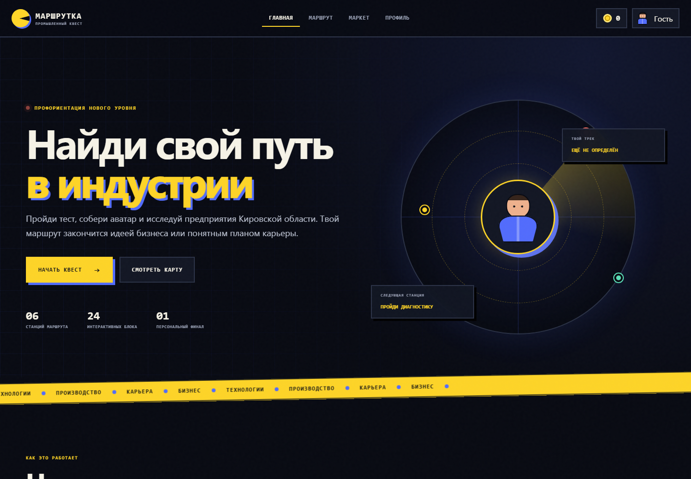

# Маршрутка — промышленный профориентационный квест

**Маршрутка** — демонстрационный MVP платформы, которая помогает школьникам и
студентам познакомиться с промышленными предприятиями региона и выбрать один
из двух профессиональных треков:

- технологическое предпринимательство;
- карьера в найме на промышленном предприятии.

Пользователь проходит диагностику, создаёт цифрового героя, исследует
предприятия в формате игрового маршрута и получает персональный результат:
идею бизнес-проекта или карьерную траекторию.



---

## Концепт проекта

### Проблематика

Молодым людям сложно понять:

- какие промышленные предприятия работают в их регионе;
- какие специалисты востребованы на производстве;
- чем отличается работа в компании от запуска собственного проекта;
- какое обучение и первый практический опыт помогут начать карьеру.

### Идея

«Маршрутка» объединяет профориентационную диагностику, игровой маршрут,
знакомство с предприятиями и персональные рекомендации в одном веб-приложении.
Вместо скучного перечня вакансий пользователь получает интерактивный квест,
где каждое предприятие — станция с пазлом из четырёх блоков, а финал маршрута —
конкретная идея бизнес-проекта или карьерная карта.

### Целевая аудитория

| Аудитория | Потребность |
|---|---|
| Школьники 14–18 лет | Познакомиться с профессиями и выбрать направление обучения |
| Студенты колледжей и вузов | Найти предприятия, стажировки и карьерные роли |
| Педагоги | Использовать интерактивный инструмент профориентации |
| HR-команды предприятий | Рассказывать молодёжи о производстве и профессиях |

### Педагогическая механика

Проект строится вокруг четырёхшагового цикла:

1. **Диагностика** — 7 ситуационных вопросов с детерминированным скорингом
   (без внешней LLM). Оцениваются инициатива, аналитическое мышление и
   способность работать в команде. По сумме баллов определяется трек:
   «предпринимательство» или «карьера в найме».
2. **Аватар** — визуальная идентификация через конструктор персонажа с
   выбором тона кожи, цвета волос и экипировки. Стилизация под объёмного
   игрового героя средствами CSS (без WebGL/Canvas).
3. **Маршрут** — 6 последовательных станций-предприятий, каждая из которых
   построена по модели 4-частного пазла: история → продукты → профессии →
   персональный выбор. Блоки открываются последовательно, следующая станция
   разблокируется только после полного прохождения предыдущей.
4. **Финал** — для трека «предпринимательство» формируется идея цифрового
   продукта с целевым клиентом, гипотезой ценности и первыми шагами проверки.
   Для трека «карьера» — рекомендуемая профессия, направление обучения,
   практические навыки и следующий шаг к стажировке.

---

## Функциональность MVP

### Профиль участника

- имя и фамилия;
- email;
- категория: школьник, студент колледжа или студент вуза;
- персональный трек;
- баланс игровых баллов;
- история заявок на экскурсии;
- достижения и прогресс.

### Диагностика

- 7 ситуационных вопросов;
- простая система скоринга без внешней LLM;
- оценка инициативы, аналитики и командности;
- определение трека «предпринимательство» или «карьера в найме».

В интерфейсе диагностика представлена как AI-модуль, но в MVP используется
детерминированная логика ветвления, как и предусмотрено техническим заданием.

### Конструктор аватара

- выбор тона кожи;
- выбор цвета волос;
- выбор экипировки;
- случайная генерация образа;
- стилизация под объёмного игрового персонажа средствами CSS.

### Маршрут предприятий

- 6 последовательных станций;
- постепенная разблокировка этапов;
- общий процент прохождения;
- персональная текущая миссия;
- отображение развиваемых навыков.

### Пазл предприятия

Каждая станция состоит из четырёх блоков:

1. история и масштаб предприятия;
2. продукты и производственные направления;
3. профессии и карьерные роли;
4. персональный выбор пользователя.

После каждого блока пользователь выполняет короткое задание и получает баллы.

### Геймификация

- энергия маршрута за выполненные действия;
- достижения;
- уровни прогресса;
- витрина наград;
- обмен баллов на демонстрационные награды;
- заглушка производственной мини-игры.

### Экскурсии

После прохождения станции пользователь может заполнить форму заявки:

- выбрать дату;
- указать телефон;
- сохранить заявку в профиле.

В демо данные не отправляются во внешнюю систему.

### Итог маршрута

Для предпринимательского трека формируется:

- идея промышленного цифрового продукта;
- целевой клиент;
- гипотеза ценности;
- первые шаги проверки идеи.

Для карьерного трека формируется:

- рекомендуемая профессия;
- направление обучения;
- практические навыки;
- следующий шаг к стажировке и трудоустройству.

---

## Пользовательский сценарий

1. Пользователь открывает главную страницу.
2. Создаёт локальный профиль.
3. Отвечает на 7 вопросов диагностики.
4. Получает персональный трек.
5. Настраивает цифрового аватара.
6. Открывает первое предприятие.
7. Последовательно проходит четыре части пазла.
8. Получает баллы и открывает следующую станцию.
9. При желании сохраняет заявку на экскурсию.
10. Завершает маршрут и получает итоговую рекомендацию.
11. Обменивает накопленные баллы в демонстрационном маркете.

---

## Игровая механика

| Действие | Награда |
|---|---:|
| Завершение диагностики | 40 баллов |
| Первое создание аватара | 25 баллов |
| Информационный блок предприятия | 20 баллов |
| Финальный выбор на предприятии | 35 баллов |
| Заявка на экскурсию | 15 баллов |

Повторное открытие уже пройденного блока не начисляет баллы повторно.

Маршрут построен последовательно: новая станция открывается только после
завершения четырёх блоков предыдущей.

---

## Архитектура проекта

### Принципы

- **Zero-dependency frontend** — клиентская часть на чистом JavaScript без
  фреймворков и сборщиков. Это позволяет запустить, изучить и изменить
  проект без установки клиентских зависимостей.
- **Single Page Application** — четыре экрана (Главная, Маршрут, Маркет,
  Профиль) реализованы как секции внутри одного HTML-документа с переключением
  через CSS-класс `active`. Модальные окна рендерятся динамически через JS.
- **Локальное состояние** — все данные хранятся в `localStorage` под ключом
  `marshrutka-state`. Это исключает потребность в backend-базе на этапе MVP
  и позволяет продолжить маршрут после перезагрузки страницы.
- **Статический сервер** — Node.js HTTP-сервер без внешних зависимостей
  (только встроенные модули `fs`, `path`, `url`, `http`). Отдаёт файлы из
  `public/`, для SPA-маршрутов возвращает `index.html`.
- **Контейнеризация** — Docker-образ на базе `node:20-alpine` с проверкой
  синтаксиса на этапе сборки и healthcheck'ом.

### Диаграмма потоков данных

```text
┌───────────────────────────────────────────────────────┐
│                    Браузер                            │
│                                                       │
│  ┌───────────┐  ┌───────────┐  ┌───────────────────┐  │
│  │  Экраны   │  │ Модальные │  │   localStorage    │  │
│  │  (home,   │  │   окна    │  │  marshrutka-state │  │
│  │  route,   │  │ (регист-  │  │                   │  │
│  │  market,  │  │  рация,   │  │  · profile        │  │
│  │  profile) │  │  тест,    │  │  · track          │  │
│  │           │  │  пазлы,   │  │  · avatar         │  │
│  └─────┬─────┘  │  аватар,  │  │  · score          │  │
│        │        │  финал)   │  │  · completed      │  │
│        │        └─────┬─────┘  │  · skills         │  │
│        │              │        │  · tours          │  │
│  ┌─────┴──────────────┴──────┐ │  · rewards        │  │
│  │        app.js             │ └────────┬──────────┘  │
│  │                           │          │             │
│  │  · Состояние (state)      │◄─────────┘             │
│  │  · Рендеринг (renderAll)  │                        │
│  │  · Навигация (showScreen) │                        │
│  │  · Игровая логика         │                        │
│  └───────────────────────────┘                        │
└─────────┬─────────────────────────────────────────────┘
          │
          │ HTTP (статическая раздача)
          ▼
┌─────────────────────────────────────────────────────┐
│              Node.js сервер (server/index.js)       │
│                                                     │
│  · Раздача public/ как статики                      │
│  · Content-Type по расширению файла                 │
│  · SPA fallback: все пути → index.html              │
│  · Без внешних npm-зависимостей                     │
└─────────────────────────────────────────────────────┘
```

### Компонентная модель (app.js)

Ядро клиентской логики организовано вокруг одной глобальной переменной
состояния `state` и набора чистых функций рендеринга:

```text
state (глобальное состояние)
  ├── profile          { name, email, category } | null
  ├── track            "business" | "career" | null
  ├── score            number
  ├── avatar           { skin, suit, hair }
  ├── avatarCreated    boolean
  ├── answers          number[]
  ├── skills           { initiative, analytics, team }
  ├── completed        { [companyId]: { pieces[], choice } }
  ├── tours            { companyId, date, phone }[]
  └── rewards          string[]

Функции рендеринга:
  renderAll()         — полный перерендер (header + все экраны)
  renderHeader()      — имя, баллы, аватар, трек в хедере
  renderMiniRoute()   — превью станций на главной
  renderRoute()       — карта станций с пазлами
  renderMarket()      — витрина наград
  renderProfile()     — карточка профиля и достижения

Функции жизненного цикла:
  loadState()         — чтение из localStorage с дефолтами
  saveState()         — запись в localStorage
  showScreen(name)    — переключение экранов + рендер

Игровые механики:
  startTest()         — запуск диагностики (activeQuestion = 0)
  finishTest()        — подсчёт трека и навыков
  openCompanyPiece()  — открытие блока пазла предприятия
  completePiece()     — завершение блока с начислением баллов
  claimReward()       — обмен баллов на награду в маркете
```

### Структура файлов

```text
16/
├── public/                        # Клиентское Single Page Application
│   ├── index.html                 # Разметка всех экранов и модальных окон
│   │                              #   · 4 экрана: home, route, market, profile
│   │                              #   · Хедер с навигацией и статус-панелью
│   │                              #   · Модальная подложка для диалогов
│   │                              #   · Toast-уведомления
│   │
│   ├── styles.css                 # Дизайн-система (1791 строка)
│   │                              #   · CSS-переменные: 14 токенов (цвета,
│   │                              #     тени, радиусы)
│   │                              #   · Адаптивная вёрстка через media queries
│   │                              #   · Анимации: радар, тикер, переходы
│   │                              #   · Компоненты: кнопки, карточки, модалки,
│   │                              #     аватар (CSS-персонаж), пазлы, станции,
│   │                              #     прогресс-бары, достижения
│   │                              #   · Тёмная тема (постоянная)
│   │
│   └── app.js                     # Данные, состояние и интерактивные сценарии
│                                  #   (852 строки)
│                                  #   · 6 предприятий-станций (companies[])
│                                  #   · 7 вопросов диагностики (questions[])
│                                  #   · 6 наград маркета (rewards[])
│                                  #   · Глобальное состояние (state)
│                                  #   · Функции рендеринга и навигации
│                                  #   · Игровая логика и геймификация
│
├── server/
│   └── index.js                   # Статический Node.js HTTP-сервер
│                                  #   · Zero external dependencies
│                                  #   · MIME-типы по расширениям
│                                  #   · SPA fallback: все пути → index.html
│                                  #   · Защита от directory traversal
│
├── docs/
│   └── interface-preview.png      # Превью интерфейса для README
│
├── package.json                   # Команды запуска и проверок
│                                  #   · npm start → node server/index.js
│                                  #   · npm dev   → node --watch (режим разработки)
│                                  #   · npm test  → проверка синтаксиса JS
│                                  #   · engines: node >= 20
│
├── Dockerfile                     # Production-контейнер
│                                  #   · Базовый образ: node:20-alpine
│                                  #   · Проверка синтаксиса на этапе сборки
│                                  #   · Healthcheck каждые 15 секунд
│                                  #   · Запуск от непривилегированного пользователя
│
├── compose.yaml                   # Docker Compose
│                                  #   · Проброс порта 47626 → 4173
│                                  #   · Переменная окружения PORT
│                                  #   · Политика перезапуска: unless-stopped
│
├── .dockerignore
├── .gitignore
└── README.md
```

### Карта экранов и модальных окон

```text
Экраны (секции <section class="screen">):
  home     — лендинг с радаром, шагами, мини-картой
  route    — карта станций, панель миссии, скиллы
  market   — витрина наград с ценами и обменом
  profile  — карточка профиля, метрики, достижения

Модальные окна (рендерятся в #modal):
  · Регистрация (имя, email, категория)
  · Диагностика (7 вопросов с прогресс-баром)
  · Результат теста (трек + навыки)
  · Конструктор аватара (skin, hair, suit + random)
  · Пазл предприятия (4 блока × 6 станций)
  · Завершение станции (переход / экскурсия)
  · Форма заявки на экскурсию (дата, телефон)
  · Заглушка мини-игры (симулятор производства)
  · Финал маршрута (бизнес-идея или карьерная карта)
```

---

## Хранение данных

MVP не использует backend-базу. Состояние сохраняется в браузере через
`localStorage` под ключом:

```text
marshrutka-state
```

Сохраняются:

- профиль;
- результат диагностики;
- параметры аватара;
- пройденные блоки;
- выбранный формат сотрудничества;
- баллы;
- заявки на экскурсии;
- полученные награды.

Это позволяет продолжить маршрут после перезагрузки страницы на том же
устройстве и в том же браузере.

---

## Локальный запуск

### Требования

- Node.js 20 или новее.

### Через Node.js

```bash
git clone https://github.com/markovrv/aksel26-cmd16-mvp.git
cd 16
npm start
```

После запуска приложение доступно по адресу:

```text
http://localhost:4173
```

### Режим разработки

```bash
npm run dev
```

Сервер перезапускается автоматически при изменении файлов (флаг `--watch`).

### Без Node.js

Приложение полностью статическое. Можно открыть файл:

```text
public/index.html
```

Некоторые браузеры строже обрабатывают локальные `file://`-страницы, поэтому
для разработки рекомендуется запуск через `npm start`.

### Проверка JavaScript

```bash
npm test
```

Команда проверяет синтаксис клиентской логики и сервера без их выполнения.

---

## Запуск в Docker

### Docker Compose

```bash
docker compose up --build
```

Приложение откроется на внешнем порту 47626:

```text
http://localhost:47626
```

Внутри контейнера сервер слушает порт 4173, заданный переменной окружения
`PORT`. Внешний порт можно изменить:

```bash
APP_PORT=8080 docker compose up --build
```

### Обычный Docker

```bash
docker build -t marshrutka-mvp .
docker run --rm -p 4173:4173 marshrutka-mvp
```

---

## Публикация на GitHub Pages

Статические файлы из `public/` публикуются через GitHub Actions.
Для первой публикации в настройках репозитория нужно выбрать:

```text
Settings → Pages → Source → GitHub Actions
```

После выполнения workflow сайт будет доступен по адресу:

```text
https://markovrv.github.io/aksel26-cmd16-mvp/
```

---

## Технологии

- HTML5;
- CSS3 (переменные, flexbox, grid, анимации, адаптивные media queries);
- Vanilla JavaScript (ES modules не требуются — весь код в одном файле);
- CSS-персонаж (объёмный аватар без WebGL и Canvas);
- Local Storage (сериализация состояния в JSON);
- Node.js HTTP server (zero external dependencies: только `fs`, `path`, `url`, `http`);
- Docker (multi-stage build, healthcheck, non-root user);
- Docker Compose;
- GitHub Actions;
- GitHub Pages.

Проект намеренно не использует frontend-фреймворк и сборщик: MVP можно
запустить, изучить и изменить без установки клиентских зависимостей.

---

## Ограничения демо

- контент предприятий является демонстрационным;
- диагностика не является психологическим или кадровым заключением;
- данные форм не отправляются на сервер;
- авторизация и синхронизация между устройствами отсутствуют;
- маркет не выполняет реальные заказы;
- игровая производственная механика представлена интерактивной заглушкой;
- полноценная административная панель не входит в текущую версию.

---

## Возможное развитие

- backend и база данных для профилей и прогресса;
- админ-панель управления предприятиями и контентом;
- реальные видеоматериалы и задания от партнёров;
- рейтинг участников и групп;
- интеграция с календарём экскурсий;
- полноценная производственная мини-игра;
- цифровое портфолио навыков;
- рекомендации на основе расширенного опросника;
- личные кабинеты педагогов и HR-команд.